# React-Note

## Table of Contents
  - [Why need Framework](#why-need-framework)
  - [Talk about React](#talk-about-react)
  - [Start for beginner](#start-for-beginner)
  - [Virtual DOM](#virtual-dom)
  - [JSX](#jsx)
  - [Doc structure](#doc-structure)
  - [Props](#props)
  - [Function vs Class](#function-vs-class)
  - [useState](#usestate)
  - [useEffect](#useeffect)
  - [useRef](#useref)
  - [useContext](#usecontext)
  - [memo](#memo)  
  - [useCallback](#usecallback) 
  - [useMemo](#usememo)
  - [Redux](#redux)
  - [Packages](#packages)

---

## Why need Framework
首先,我們必須思考為什麼需要前端框架或是函式庫？

以前的網站互動性沒有很高,所以頁面內容可以操作DOM元素

但隨著前端越來越複雜,使用者的體驗會隨著頁面的重複操作DOM元素導致頁面刷新或是消耗巨大的操作成本,也造成開發者的難以維護與開發

而框架與函式庫幫助我們達到UI和資料分離,使得開發與維護更容易

而框架跟函式庫幫助我們專注在資料和介面,像是一些user event都會幫我們包裝好！！！

---

[⬆️ Back To Contents](#Table-of-Contents)

## Talk about React
這個小節我們來講講React是什麼

不同於Vue、Angular, React的定位並不是框架而是Library

我們了解到React本身專注在UI和資料,而react-router-dom、redux...都是社群開發者提供並且維護

所以其實學習React你不需要消耗多少時間去學習它,反倒是學習周遭的套件、工具會比較困難,這也是React為什麼沒有`最佳實踐`的原因之一

最後Vue vs React根本是偽命題

Vue提供很多的API和完整的官方文檔,但相對的沒有這麼彈性,要學的也比較多,但對於入門前端,Vue反而比較推

React其實就是JavaScript的原生寫法,只是把JavaScript和HTML綁在一起,對於JavaScript底子紮實的人,非常容易上手

---

[⬆️ Back To Contents](#Table-of-Contents)

## Start for beginner
* Environment
  * [Node.js version (LTS)](https://nodejs.org/en/)
  * [Basic HTML、CSS](https://www.w3schools.com/css/)
  * [Strong JavaScript (ES6)](https://javascript.info/)
* Rendering way  
  * [Next.js(Server Side Rendering, SSR)](https://nextjs.org/)
  * [React (Single Page Application, SPA)](https://reactjs.org/)

```javascript
npx create-react-app <fileName>
```

---

[⬆️ Back to Contents](#table-of-contents)

## Virtual DOM
接著讓我們真正進入React的入門磚就是Virtual DOM

Virtual DOM使用Diff演算法比對當前和前一個元素狀態是否一致

只有狀態改變才會更新畫面,進而達到效能優化不過度更新畫面造成效能浪費

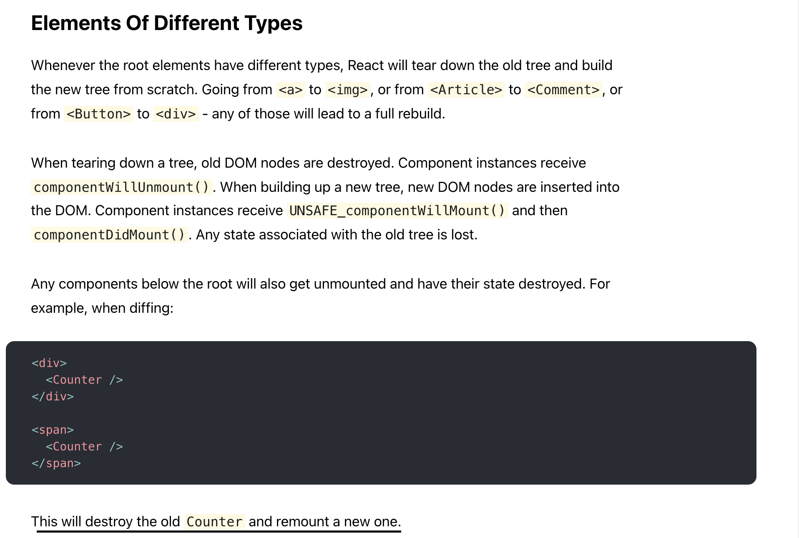
> resourse by https://reactjs.org/docs/reconciliation.html

---

[⬆️ Back to Contents](#table-of-contents)

## JSX
由於React擁抱資料決定畫面的方式,JavaScript in HTML是非常好的實踐方法

而React官方有說使用JSX不是必要的,但我想會使用React應該也會使用JSX吧哈哈哈

```javascript
const user = "Ian"
const navbar = <h1>{user}</h1>
```

這邊React官方告訴我們JSX並不是必要的

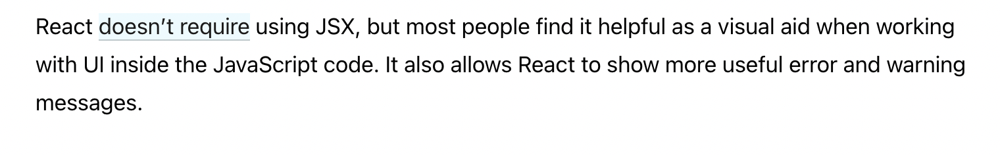

---
[⬆️ Back to Contents](#table-of-contents)

## Doc structure
* src(存放所有開發的檔案)
* public(掛載root)

首先我們可以打開public -> index.html 
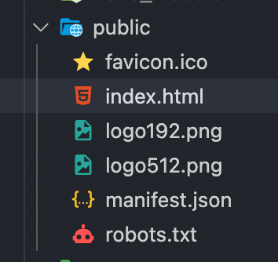

可以發現只有一個root根節點

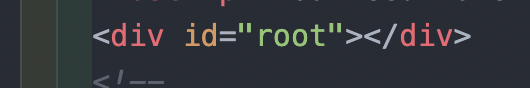

然後我們打開src,也就是開發都是在這個檔案夾

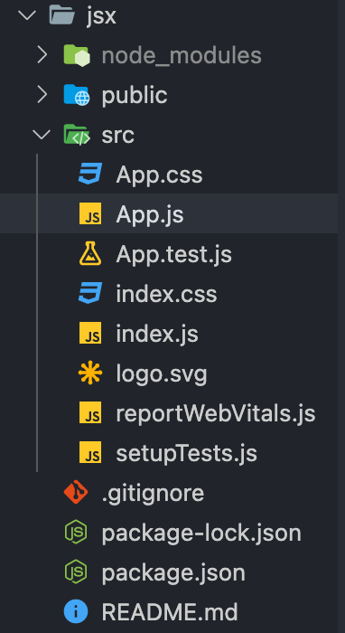

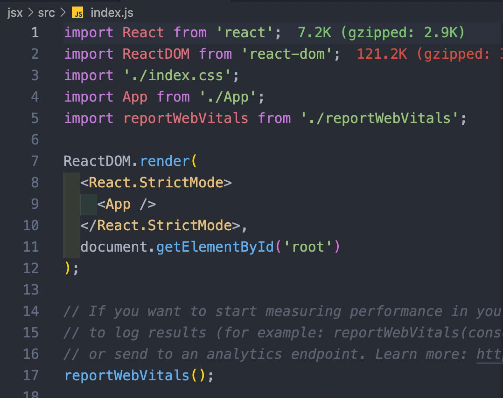

我們可以看到React幫我們把element掛載在root根節點上


接著切到package.json

這邊存放著所有的script和套件包

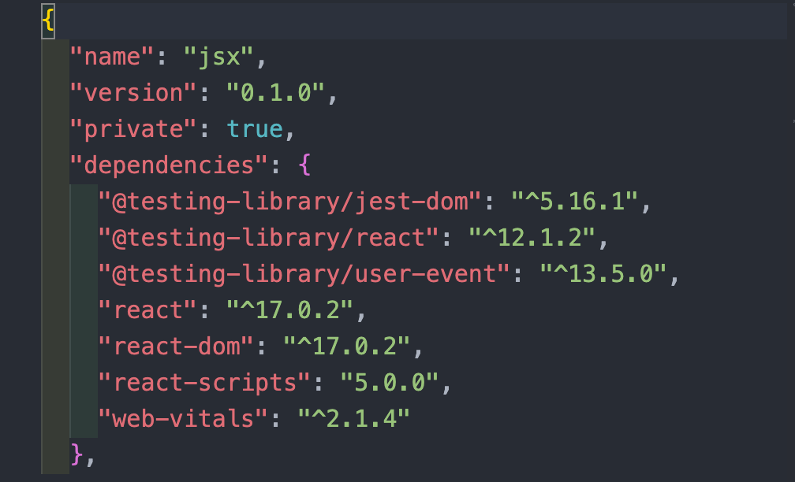

---
[⬆️ Back to Contents](#table-of-contents)

## Props
首先我們先來看一下我們目前的結構
```javascript
//index.js
import ReactDom from 'react-dom'
import App from './App'

ReactDom.render(
    <App />,document.getElementById('root')
)

//App.js
import React from 'react';

function App() {
  return <div>
      Hello World
  </div>;
}

export default App  
```
然後,我們在src底下建立components的檔案夾,並且建立一個Child的組件

這邊要注意 組件的開頭一定要大寫

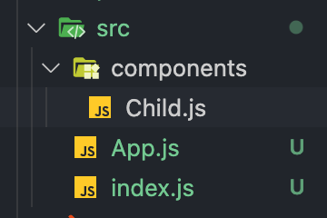

當我們今天在父組件有資料要傳遞給子組件就必須使用props傳遞

```javascript
const text = "Hello World";
<Component   text={text} />
```

```javascript
//App.js
import React from 'react';
import Child from './components/Child';
function App() {
    const user = "Dennis"
  return <div>
      <Child user={user}/>
  </div>;
}

export default App  

//Child.js
import React from 'react';

function Child(props) {
    console.log(props);
  return <div>
      {props.user}
  </div>;
}

export default Child;

```

我們把props打印出來看看

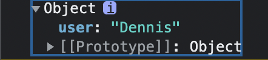

發現是一個物件,那我們就可以使用解構語法來使程式碼更容易閱讀

```javascript
import React from 'react';

function Child({user}) {
    return <div>
        {user}
    </div>;
}

export default Child;

```

使用物件傳遞多個props

```javascript
    const [date, setDate] = useState('')    
    const [isOpen, setIsopen] = useState(false)
    const [theme, setTheme] = useState('light')
    const [language, setLanguage] = useState('zh')
    
    const props = {
        isOpen,
        setIsopen,
        language,
        setLanguage,
        theme,
        setTheme
    }
    return(
      <Component {...props} />
    )
```

---
[⬆️ Back to Contents](#table-of-contents)

## Function vs Class

---
[⬆️ Back to Contents](#table-of-contents)

## useState
* 接受一個初始值
* 取出的第二參數為set+駝峰寫法(非強制,約定成俗)


在React中,如果有人說這個組件的狀態是什麼,就是意指當前的資料

而我們要在函數組件中建立state,必須使用useState幫我們建立

先從React中引入該模組

```javascript
import React, { useState } from 'react;
```
接著在組件中定義

```javascript
    const numState = useState(100)
```

打印出來看看

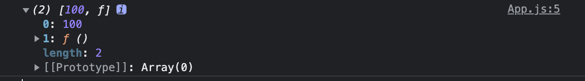

可以發現useState是個陣列,我們要取用裡面的初始值和方法可以使用解構賦值

```javascript
const [num, setNum] = useState(100)
```

那假如我今天有一個button可以增加數值該怎麼使用呢？？？

```javascript
function App() {
    const [num, setNum] = useState(0)

    return (
      <div>
        <p>{num}</p>
        <button onClick={setNum(num + 1)}>Add</button>
    </div>);
}
```

但由於React檢查狀態的方式不只是數值,還有function的記憶體位址,所以我們需要使用arrow function綁定set function

```javascript
function App() {
    const [num, setNum] = useState(0)

    return (
      <div>
        <p>{num}</p>
        <button onClick={()=> setNum(num + 1)}>Add</button>
    </div>);
```

當然在實作上我們也會傳遞函式,會更清楚

```javascript
function App() {
    const [num, setNum] = useState(0)
    const addFn = () => {
      setNum(num + 1)
    }
    return (
      <div>
        <p>{num}</p>
        <button onClick={addFn}>Add</button>
    </div>);
```

!!! 若要更動state必須使用method,切勿使用給值方式

```javascript
num = 1000
```

---
[⬆️ Back to Contents](#table-of-contents)

## useEffect
* 接受兩個參數
* useEffect(callback, dependency)
* dependency
  * [] 只在頁面掛載完成執行一次callback
  * [value] 該監控之變數改變才會執行callback
  * 若為empty即每當組件有重新渲染,即執行callback
一樣先建立好我們的組件
```javascript
import React,{ useEffect , useState} from 'react';

function App() {
  const [num ,setNum] = useState(0)
  return <div>
    <p>{num}</p>
    <button onClick={() => setNum(num+1)}>Add</button>
  </div>;
}

export default App;
```

引入useEffect,並且每次num改變數值,呼叫console.log(num)

```javascript
import React,{ useEffect , useState} from 'react';

function App() {
  const [num ,setNum] = useState(0)
  useEffect(() => {
    console.log(num);
  }, [num])
  
  return (
    <div>
      <p>{num}</p>
      <button onClick={() => setNum(num+1)}>Add</button>
    </div>);
}

export default App;

```

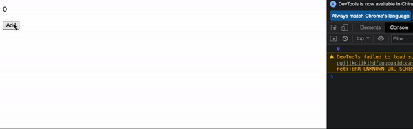

我們來看其他dependency的狀態

```javascript
import React,{ useEffect , useState} from 'react';

function App() {
  const [num ,setNum] = useState(0)
  
  useEffect(() => {
    console.log("React init");
  },[])

  useEffect(() => {
    console.log("every render will executive");
  },)

  useEffect(() => {
    console.log(num);
  }, [num])

  return <div>
    <p>{num}</p>
    <button onClick={() => setNum(num+1)}>Add</button>
  </div>;
}

export default App;

```


---
[⬆️ Back to Contents](#table-of-contents)

## useRef
* 回傳物件
* 直接操作DOM元素

```javascript
const inputRef = useRef('')
```
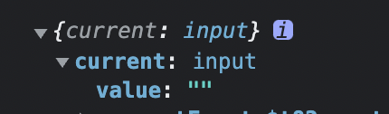

可以發現回傳一個物件current可以取得我們的value

下面直接示範點擊button可以focus input

```javascript
import React, {useState, useRef} from 'react';

function App() {
    //* use useRef get reference
    const inputRef = useRef('')
    //button click function
    const focusFn = () => {
        inputRef.current.focus()
    }
    //then we need to bind input ref
    return (
        <div>
            <input type="text" ref={inputRef} placeholder='input something'/>
            <button onClick={focusFn}>focus</button>
        </div>);
}

export default App;
```

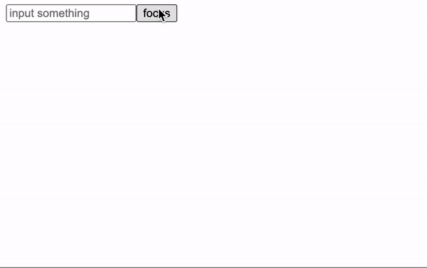

---
[⬆️ Back to Contents](#table-of-contents)

## useContext
* 建立一個全域資料
* 避免不必要的組件接受資料
* `contextAPI`
  * `<Provider value={data}>`

```javascript
const value = useContext(Provider)
```

首先了解檔案結構

我們只要傳遞資料給component3,所以component2即為不需要接收資料之組件

```javascript
             App
          / 
        component2
        /
      component3  
```


```javascript
//App.js
import React,{createContext, useState, useEffect} from 'react';
import Component2 from './components/Component2'

export const Data = createContext(null)

function App() {
  const [user, setUser] = useState('Empty')
  return (
    <Data.Provider value={user}>
      <Component2 />
    </Data.Provider>
  );
}

export default App;

```

```javascript
//component2
import React from 'react';
import Component3 from './Component3';
function Component2() {
    return <div>
        <Component3 />
    </div>;
}   

export default Component2
```

```javascript
//component3
import React, {useContext} from 'react';
import { Data } from '../App';
function Component3() {
    const data = useContext(Data)
    return(
        <div>{data}</div>
    )
}

export default Component3;

```

---
[⬆️ Back to Contents](#table-of-contents)

## memo
* 解決子組件被父組件強迫更新
* memo無法記憶傳遞call by reference之 props


由於React會去檢查組件中的值跟記憶體是否一樣,但這樣也造成一些問題

我們來看一個例子

```javascript
//App.js
import React, {useState} from 'react';
import Component2 from './components/Component2';
function App() {
    const [text, setText] = useState('')
    return (
    <div>
        <input type="text" onChange={(e) => setText(e.target.value)}/>
        <p>{text}</p>
        <Component2  text="Ian"/>
    </div>
    );
}

export default App;


//Component2.js
import React from 'react';

function Component2({text}) {
    for(let i = 0; i < 3; i++) {
        console.log(i);
    }
    console.log('1');

    return <div>
        user:{text}
    </div>;
}

export default (Component2);
```
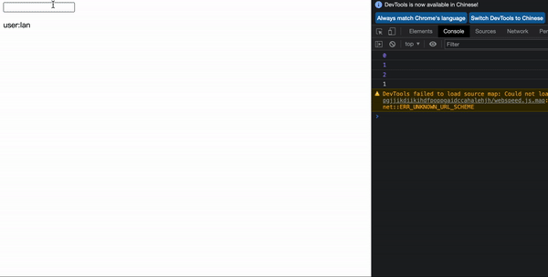

我們發現Component2傳遞的Props是固定的,但由於父組件被迫更新

這時候我們可以使用React提供的memo HOC記住Props的值,使其讓React知道不需更新

```javascript
//App.js
import React, {useState} from 'react';
import Component2 from './components/Component2';
function App() {
    const [text, setText] = useState('')
    return (
    <div>
        <input type="text" onChange={(e) => setText(e.target.value)}/>
        <p>{text}</p>
        <Component2  text="Ian"/>
    </div>
    );
}

export default App;

//Component2.js
function Component2({text}) {
    for(let i = 0; i < 3; i++) {
        console.log(i);
    }
    console.log('1');

    return <div>
        user:{text}
    </div>;
}

export default memo(Component2);
```

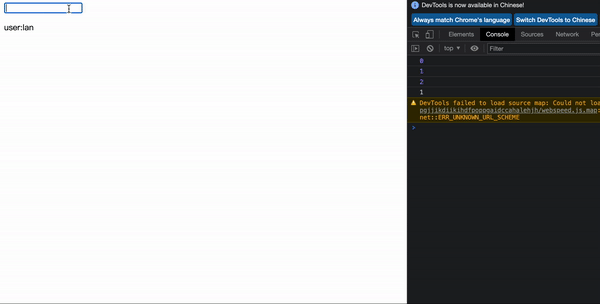

我們看到了子組件確實沒有被迫更新了

但凡事有個例外,當我今天沒有傳遞Props或是傳遞非物件、陣列都可以達到memo的效果

```javascript
import React, {useState} from 'react';
import Component2 from './components/Component2';
function App() {
    const [text, setText] = useState('')
    return (
    <div>
        <input type="text" onChange={(e) => setText(e.target.value)}/>
        <p>{text}</p>
        <Component2  text={text}/>
    </div>
    );
}

export default App;
```

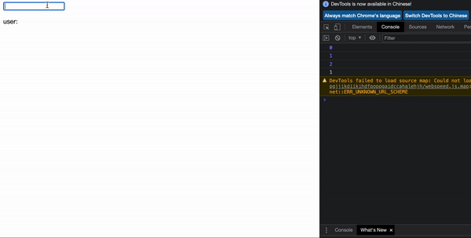

若要達到記憶call by reference可以參考useCallback

---
[⬆️ Back to Contents](#table-of-contents)

## useCallback
* 解決父組件傳遞function 比對記憶體位址的效能優化問題


---
[⬆️ Back to Contents](#table-of-contents)

## useMemo
* 避免重複運算造成消耗效能


---
[⬆️ Back to Contents](#table-of-contents)

## Redux
* 解決子組件獲取資料的問題
[Redux official](https://redux.js.org/introduction/getting-started)
### Setup
以下指令適配於react application
```javascript=
npm install react-redux
```
當然我們也需要安裝redux
```javascript=
npm install redux @reduxjs/toolkit
```

### Introduction
* 基本概念
    * Store
    * Reducer
    * Slice
    * Action
    * Dispatch
* 常用API
    * useSelector(callback)
    * useDispatch
    * configureStore
    * createSlice

```javascript
//store.js
import { configureStore } from '@reduxjs/toolkit'

export default configureStore({
    reducer: {}
})
```

```javascript
//App.js
import { Provider } from 'react-redux'
import store from './state/store'

function App() {
    return (
        <Provider store={store}>
            //Elements
        </Provider>
    )
}  

```

創建一個themeSlice.js

[Slice tutorial](https://react-redux.js.org/tutorials/quick-start#create-a-redux-state-slice)

```javascript
import { createSlice } from '@reduxjs/toolkit'

export const themeSlice = createSlice({
    name: 'theme', //使useSelector辨識
    initialState: {
        value: {
            bgc: 'white',
            color: 'grey'
        }
    },
    reducers: {
        darkMode: (state, action) => {
            state.value = {
                bgc: 'black',
                color: 'grey'
            }
        },
        lightMode: (state, action) => {
            state.value = {
                bgc: 'white',
                color: 'grey'
            }
        }
    }
})

export const { darkMode, lightMode } = themeSlice.actions

export default themeSlice.reducer //導出reducers
```

並且在一開始的store.js中添加匯出的reducer

```javascript
//store.js
import { configureStore } from '@reduxjs/toolkit'
import themeReducer from './themeSlice'

export default configureStore({
    reducer: {
        theme: themeReducer
        //引入themeSlice中預設導出的themeSlice.reducer
    }
})
```

接下來在欲使用的組件中引入
```javascript
import { useSelector, useDispatch } from 'react-redux'
import { darkMode, lightMode } from '../../state/themeSlice' //引入從themeSlice中的actions
```

useSelector使用一個callback接收資料

```javascript
    const theme = useSelector((state) => state.theme.value)
```

最後的範例

```javascript
import React from 'react'
import { useSelector, useDispatch } from 'react-redux'
import { darkMode, lightMode } from '../../state/themeSlice' 
//引入從themeSlice中的actions
function Navbar() {
    const theme = useSelector((state) => state.theme.value)
    const dispatch = useDispatch()
    return (
        <NavContainer>
            <h2><IoLogoReact /></h2>
            <p>{theme.bgc}</p>
            <button onClick={() => dispatch(darkMode())}>Dark</button>
            <button onClick={() => dispatch(lightMode())}>light</button>
        </NavContainer>
    )
}

export default Navbar
```

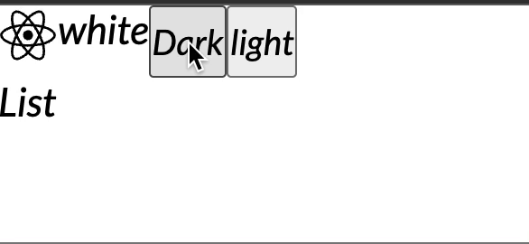

---
[⬆️ Back to Contents](#table-of-contents)

## Packages

---
[⬆️ Back to Contents](#table-of-contents)
